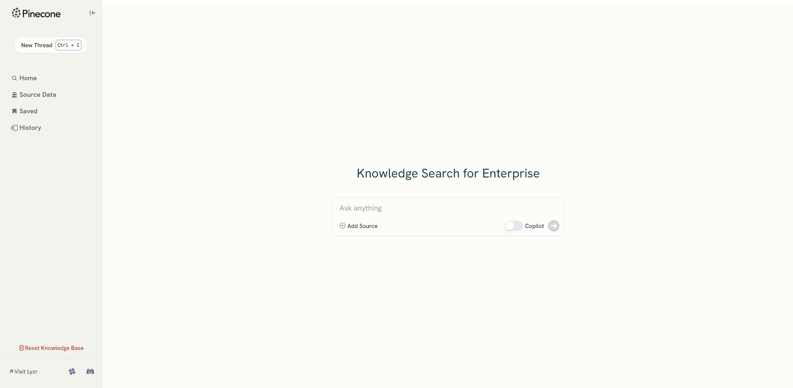

Pinecone, a leading vector database and vector similarity search engine, and Lyzr, an enterprise agent framework known for its simplicity and data privacy, have partnered to launch the ‘Knowledge Base’ application for enterprise customers. With the ‘Knowledge Base’ app, enterprises can deploy a 100% private and secure document and content search engine for their organization in their cloud account.

## How to access the demo app?

Visit https://pinecone.lyzr.ai/ to test the micro-app built on Lyzr and Pinecone.


## Key Features

- You can add any number of source data at any point in time. The vectorization and indexing are dynamic and happen as and when new data is added.
- When you search, you also get the data citations that will be useful for locating the source file.
- You can save, share, and even bookmark the search results
- The micro-app is open-sourced. You can modify the UI, add your logo and use the app as is for your organization.

## Looking to deploy the solution using open-source versions?

[Here](https://colab.research.google.com/drive/11-qAX8S3CzuofCah-8bHN2LG3AITFCYD?usp=sharing) is the colab notebook to help you get started fast.

Let’s see how it works.

1. Import the necessary libraries. OpenAI GPT4 Turbo is the LLM, Lyzr is the agent framework and Pinecone is the vector store.

```python
import openai
from pinecone import Pinecone, PodSpec
from lyzr import SearchAgent
```
2. Pass the OpenAI and Pinecone credentials
```python
os.environ["OPENAI_API_KEY"] = ""
openai.apikey = os.environ["OPENAI_API_KEY"]
PINECODE_API_KEY = os.environ["PINECODE_API_KEY"]
```
3. Setup the Pinecone vector store with Lyzr Search Agent
```python
pc = Pinecone(api_key=PINECODE_API_KEY)

pc.create_index(
	 name='lyzr-core',
	 dimension=1536,
	 metric='cosine',
	 spec=PodSpec(
		 environment='gcp-starter',
		 pod_type='starter',
		 pods=1
	 )
)

pinecone_index = pc.Index("lyzr-core")

vector_store_params = {
    "vector_store_type":"PineconeVectorStore",
    "pinecone_index":pinecone_index,
}

search = SearchAgent()
```
4. Pass the data that the RAG pipeline will access. In this example, we pass a PDF document as the data source.
```python
agent = search.add_pdf(input_files=["pdf_file_path"],vector_store_params=vector_store_params)
```
5. Ask your search query. 
```python
response = agent.query("Ask your query")
```

That’s it. You have built a personal, fully-private, open-source knowledge base for your organization in just 5 steps.