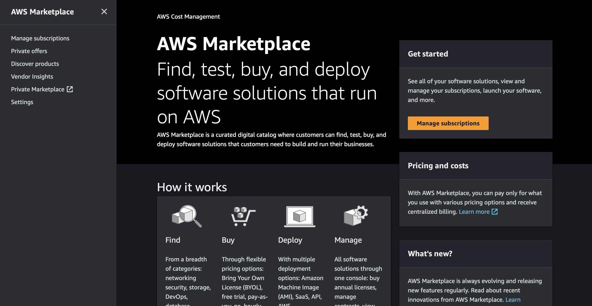
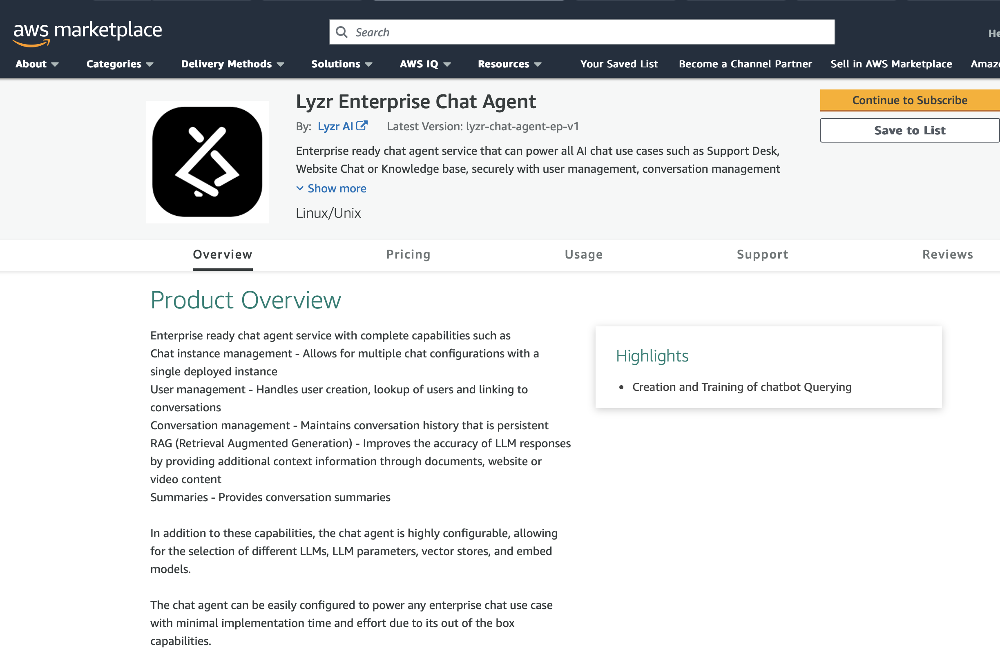
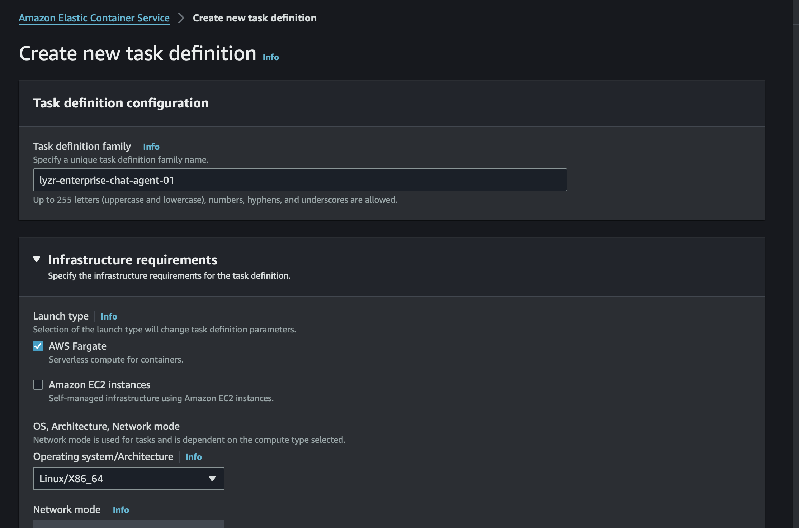
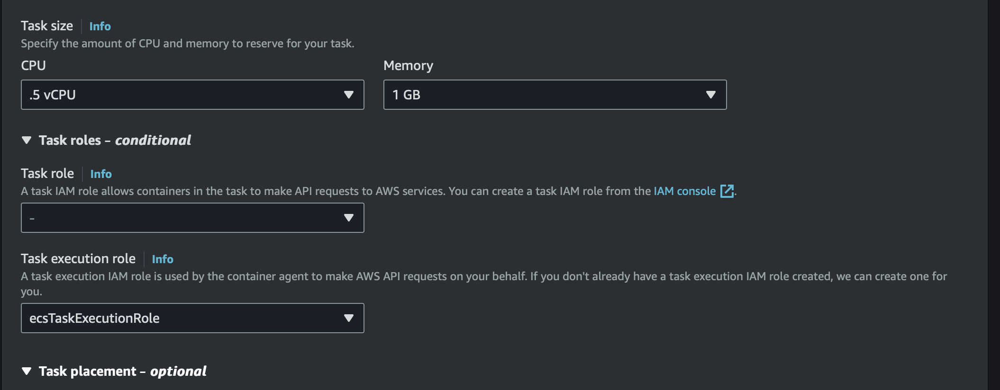
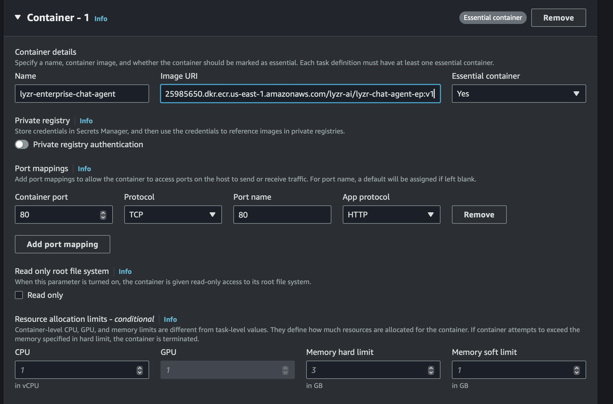
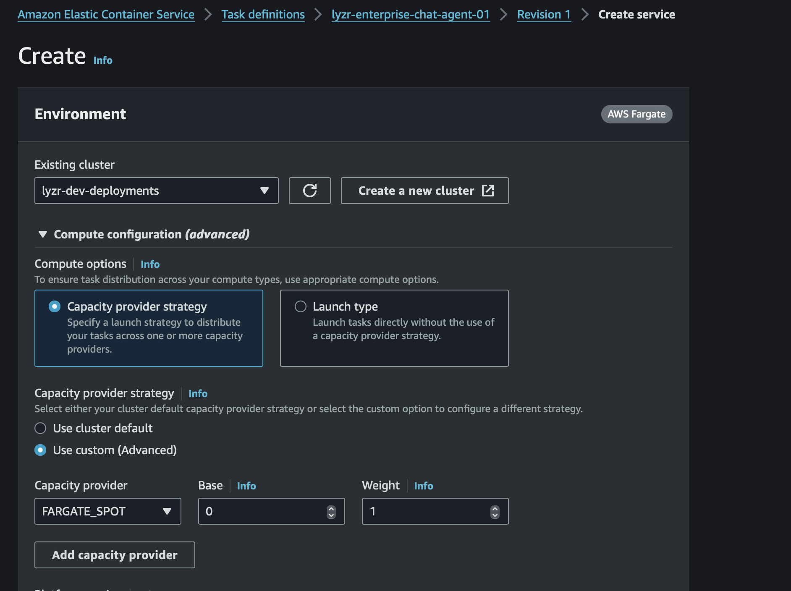
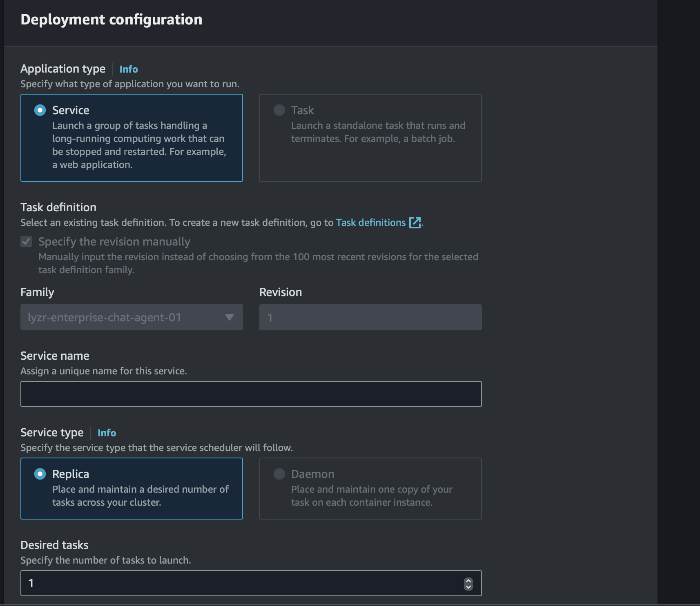
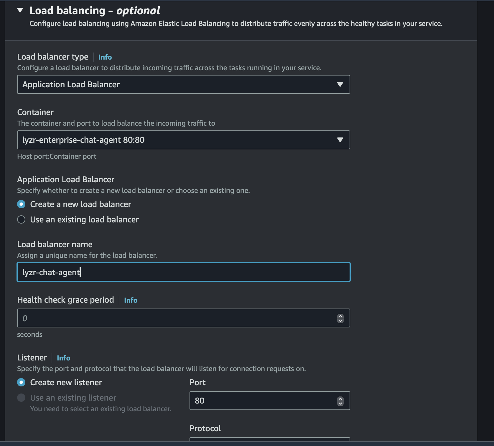
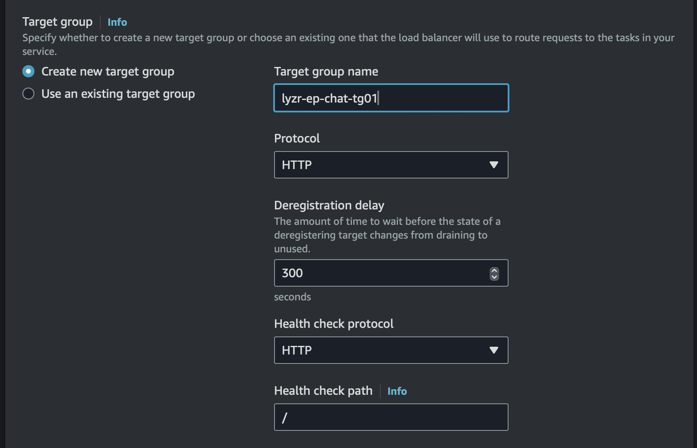
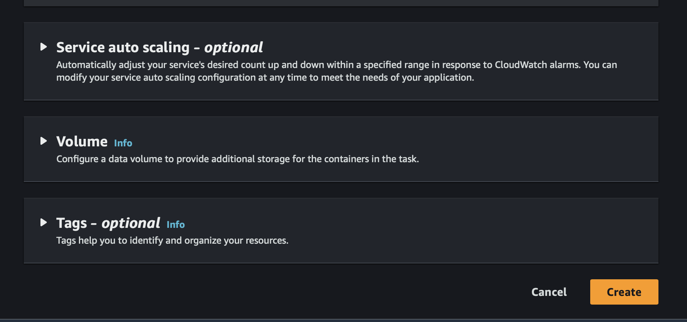

This guide will walk you through the process of deploying and managing containers in ECS using the AWS Marketplace.

For illustrative purposes, this guide will show you the steps to deploy the Lyzr Enterprise Agent on ECS.

Here are the steps you’ll follow in this tutorial:

- Subscribe to the Lyzr Enterprise Chat Agent container using the AWS Marketplace
- Deploy the Lyzr Enterprise Chat Agent container on ECS

The next sections will walk you through these steps in detail.

### Assumptions And Prerequisites

This guide assumes that:
1. You have an active AWS account. If you don’t have this, [create a new account](https://aws.amazon.com/).
2. You have a running ECS cluster. If you don’t, [launch a new one on AWS](https://docs.aws.amazon.com/ecs/).

### Step 1: Subscribe To The Lyzr Enterprise Chat Agent Container

At the end of this step, you will have subscribed to the Lyzr Enterprise Chat Agent container solution in the AWS Marketplace and obtained the details of the registry.

1. Log in to the [AWS Marketplace](https://aws.amazon.com/marketplace).

2. Search for the Lyzr Enterprise Chat Agent by entering the search term “Lyzr enterprise Chat agent” in the search bar at the top.

3. Select the Lyzr Enterprise Chat Agent container in the list of search results.

4. On the product detail page, review the details of the solution and click the “Continue to subscribe” button.

5. On the product subscription page, select “Lyzr Enterprise Chat Agent” as the software option and accept the terms

6. On the product configuration page, select “Lyzr Enterprise Chat Agent” as the fulfillment option and click the “Continue to Launch” button.

7. On the product fulfillment page, copy the URL to the AWS Marketplace registry. This URL also contains the container name and tag. You will need these details in the next step.

### Step 2: Deploy The Lyzr Enterprise Chat Agent Container On ECS

At the end of this step, you will have deployed the NGINX Exporter container on your ECS cluster.

1. The next step is to deploy the Lyzr Enterprise Chat Agent container on your ECS cluster using a task definition. Apart from filling the name and other required parameters, you will need to define the container image to use and the ports where the app is listening.

2. Create a service from the task definition you just created. You will need to select the ECS cluster you already created and set the name of the service you are creating, in this case “lyzr-enterprise-chat-agent”.

3. Access the application using the web browser or through the APIs: 

http://\<ip-address\>/docs