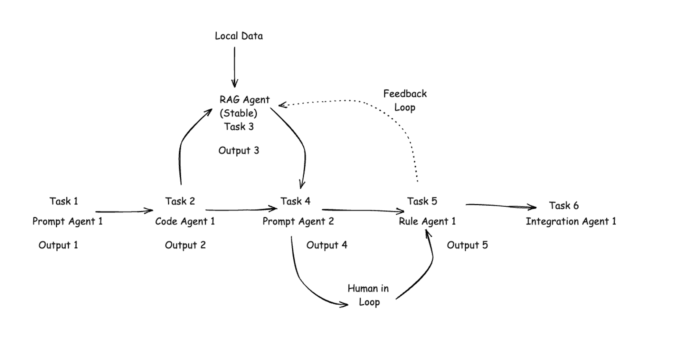
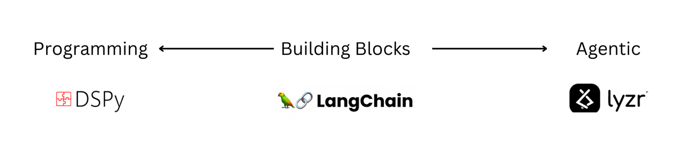

## Introducing Lyzr

Lyzr is a low-code agent framework with an `agentic` approach to building generative AI applications. Its fully integrated agents come with pre-built RAG pipelines, allowing you to build and launch in minutes. 

With Lyzr, you can build chatbots, knowledge search, data analysis, RAG-powered apps, and multi-agent workflow automation with minimal effort. 

The best part is that you can get locally deployable SDKs and private APIs to run the agents on your cloud, thus eliminating all concerns related to data privacy, compliance, and latency.

## Who's Lyzr for?
**For Developers** - you will love the simplicity of the framework and appreciate the ability to build generative AI apps rapidly.

**For CTOs, CPOs** - integrate generative AI features into your apps seamlessly with local SDKs and private APIs, all with your in-house tech team. The required learning curve to build on Lyzr is literally just a few minutes.

**For CIOs** - introduce generative AI to your enterprise with the comfort of 100% data privacy and security as Lyzr runs locally on your cloud. And Lyzr's AI Management System (AIMS) makes it easy to manage agents, monitor events logs, build using AI studios, and even help your team learn generative AI with the in-built Lyzr academy.

## What can you build on Lyzr's low-code agent framework?
1. **Lyzr's Pre-built Agents: Deploy in minutes**

| Use Case         | Description                                                                                                                                                                                                                                                                                                                                                      |
| ---------------- | ---------------------------------------------------------------------------------------------------------------------------------------------------------------------------------------------------------------------------------------------------------------------------------------------------------------------------------------------------------------- |
| Chat Agent       | State-of-the-art chatbots with short-term and long-term memory, RLHF (Reinforced Learning Human Feedback), a customizable system prompt, and seamless switches between LLMs. Try Lyzr [Chat Agent](https://chatagent.lyzr.ai/)                                                                                                                                   |
| Knowledge Search | Bring perplexity-style document and data search to your organization. Lyzr's document search can handle 100,000 documents and more, retrieving information accurately every time. And you get a citation to the source along with fetching the source file. Try Lyzr [Knowledge Search](https://knowledgebase.lyzr.ai/)                                          |
| RAG Powered Apps | It is probably the most comprehensive RAG agent ever built. Just by tuning the parameters, you can choose up to 630 different RAG pipelines. You can also integrate with any LLM, vector store, embedding model, reranker, or parser of your choice. Read [Blog](https://www.lyzr.ai/how-to-build-a-state-of-the-art-sota-rag-engine/)                          |
| QA Bot           | A simplified version of Lyzr Chatbot—an accurate question-answering agent to power your help and FAQs section. QA Bots are also the best fit for handling one-way conversations like employee handbook searches, law lookup searches, etc.                                                                                                                       |
| Data Analysis    | Build a conversational analytics app on your data in a pythonic way with Lyzr's Data Analyzr agent. The text query converts into a python code that runs on a pandas dataframe invoking several ML libraries like Scikit-Learn, StatsModel etc, helping you run various analysis on your data including regression, correlation, clustering, time series and more. |
| Text-to-SQL      | Want to run an exploratory analysis on your database? Run Lyzr's Text-to-SQL agent to convert your text queries to SQL code that can handle complex joins, extract information, and build insights and recommendations.                                                                                                                                          |

2. **Lyzr Automata: The multi-agent automation platform**

Lyzr Automata is a sophisticated multi-agent automation framework designed to keep things simple, with a focus on workflow efficiency and effectiveness. It enables the creation of multiple agents that are coupled with specific tasks. The agents and tasks can run independently and complete the provided instructions, thus entering a stable state.




## How low-code is the Lyzr framework?
You need just a few lines of code to build and launch your agents. Let's see an example.
1. Install the Lyzr library.
```bash
pip install lyzr
```
2. Import the necessary agent module. Here we are choosing ChatBot module.
```python
from lyzr import ChatBot
```
3. Provision the chatbot with just 1-line of code. The RAG pipeline runs in the background.
```python
my_chatbot = ChatBot.pdf_chat(input_files=["pdf_file_path"])
```
4. That’s it. Just query and start chatting with your chatbot. 
```python
response = my_chatbot.chat("Your question here")
```

## How is Lyzr different from competitors?



**Langchain** - building blocks way of building generative AI apps

**DSPy** - programmatic way of building generative AI apps

**LlamaIndex** - modular way of building generative AI apps with organizations data

**Lyzr** - agentic way of building generative AI apps
