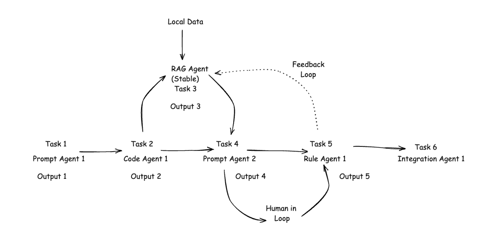

Lyzr Automata is a sophisticated multi-agent automation framework designed to keep things simple, with a focus on workflow efficiency and effectiveness. It enables the creation of multiple nodes with agents, tasks, and functions and integrates these nodes to build a pipeline. The agents and tasks can run independently and complete the provided instructions, thus entering a stable state.



## What constitutes the simplest agent automation framework?
| Automata Constructs | Description                                                                                                      | Types & Examples                           |
| ------------------- | ---------------------------------------------------------------------------------------------------------------- | ------------------------------------------ |
| Agents              | Agents have a persona and are designed to perform a task.                                                        | Prompt, Code, Integration, RAG, Chat, Data |
| Tasks               | Tasks are detailed set of instructions that the agent takes up and completes.                                    | Eg: Summarize a meeting transcript         |
| Functions           | Functions (or tools) are non-logic components designed to perform a repetitive or simple function.               | Eg: Perplexity Search Tool                 |
| Nodes               | Nodes are the states in the Automata pipeline. A node always has an Agent, a Task, and, if required, a function. |                                            |
| Pipelines           | A pipeline is a set of nodes strung together to execute a workflow.                                              |                                            |
| Models              | Models are LLMs called by the Nodes with an agent that requires an LLM.                                          | Prebuilt Models: OpenAI, Perplexity        |

## How does Lyzr Automata compare with competitors?

**LangGraph**: LangGraph by Langchain is a good tool to build workflow automation. But the complexity of Langchain and LCEL introduces a steep learning curve.

**AutoGen**: AutoGen is the OG of agents. The AutoGen framework was the first to introduce multi-agent interaction. However, due to its complexity, AutoGen has issues around debugging.

**CrewAI** is an open-source library built on Langchain. It is probably better than AutoGen in usability, but the underlying Langchain framework makes it heavy.

**Agents Dev**: A UI-powered code approach to building agents. Agents Dev can only handle sequential workflows and no DAG.


## Getting Started

### Installation

You can install our package simply by running

```bash
npm install lyzr-automata
```

## Model Calling

1. **OpenAI**

**Example for creating an OpenAI model with parameters for chat completion.**

```python
from lyzr_automata.ai_models.openai import OpenAIModel

# Creating an instance of OpenAIModel with specific configuration for chat completion

open_ai_text_completion_model = OpenAIModel(
    api_key="YOUR_OPEN_AI_KEY",
    parameters={
        "model": "gpt-4-turbo-preview",
        "temperature": 0.2,
        "max_tokens": 1500,
    },
)
```
**Parameters**

<ParamField path="parameters" type="dict">
All existing parameters supported by OpenAI's chat completion model are included by default for customizable requests. Users can pass these using the parameters dictionary.
</ParamField>
<ParamField path="api_key" type="str">
The api_key parameter is the user's OpenAI API key, required for authentication to access the chat completion service.
</ParamField>

**Example for creating an OpenAI model with parameters for image generation**

All existing parameters supported by OpenAI's image generation model are supported by default.

```python
from lyzr_automata.ai_models.openai import OpenAIModel

# Creating an instance of OpenAIModel with specific configuration for image generation

open_ai_model_image = OpenAIModel(
    api_key="YOUR_OPEN_AI_KEY",
    parameters={
        "n": 1,
        "model": "dall-e-3",
    },
)
```
<ParamField path="parameters" type="dict">
All existing parameters supported by OpenAI's image generation model are included by default for customizable requests. Users can pass these using the parameters dictionary.
</ParamField>
<ParamField path="api_key" type="str">
The api_key parameter is the user's OpenAI API key, required for authentication to access the image generation service.
</ParamField>

2. **Perplexity** 

**Example of creating a perplexity model with parameters for chat completion.**

All existing params supported by the Perplexity chat completion model are supported by default.

```python
from lyzr_automata.ai_models.perplexity import PerplexityModel

perplexity_model_text = PerplexityModel(
    api_key="YOUR_PERPLEXITY_KEY"
    parameters={
        "model": "pplx-7b-online",
    },
)
```

**Parameters**

<ParamField path="parameters" type="dict">
A dictionary supporting all existing parameters accepted by the Perplexity chat completion model for customizable requests.
</ParamField>
<ParamField path="api_key" type="str">
The user's Perplexity API key required for authentication to access the chat completion service.
</ParamField>

3. **Connect your own model to the framework**

You can bring in your own model and connect it to our framework by extending our base AIModel class.

<Steps>
  <Step title="Import">
    Import AIModel class
  </Step>
  <Step title="Params">
    You may provide initial parameters, including the API key and any model-specific parameters.
  </Step>
  <Step title="Methods">
    Crucially, create two methods: **generate_text** and **generate_image**, as stipulated by the abstract class design of AIModel.
  </Step>
</Steps>

**How to bring your own model to Lyzr Automata?** 👇

```python

from typing import Any, Dict, List
from openai import OpenAI
from lyzr_automata.ai_models.model_base import AIModel #import the AIModel base class
from lyzr_automata.data_models import FileResponse
from lyzr_automata.utils.resource_handler import ResourceBox


class MyModel(AIModel):
    def __init__(self, api_key, parameters: Dict[str, Any]):
        self.parameters = parameters
        self.client = OpenAI(api_key=api_key)
        self.api_key = api_key

    def generate_text(
        self,
        task_id: str=None,
        system_persona: str=None,
        prompt: str=None,
        messages: List[dict] = None,
    ) -> str:
        if messages is None:
            messages = [
                {"role": "system", "content": system_persona},
                {"role": "user", "content": prompt},
            ]

        response = self.client.chat.completions.create(
            **self.parameters, messages=messages
        )
        return response.choices[0].message.content

    def generate_image(
        self, task_id: str, prompt: str, resource_box: ResourceBox
    ) -> FileResponse:
        response = self.client.images.generate(**self.parameters, prompt=prompt)
        return resource_box.save_from_url(url=response.data[0].url, subfolder=task_id)
```

**Methods**

**`generate_text`** Method

Generates a text response using an AI chat model based on the provided prompt and optional parameters. This method is intended for creating conversational AI responses, leveraging the client's chat completion capabilities.

<ParamField path="task_id" type="Optional[str]">
An optional identifier for the task. Used to specify or reference a particular task instance.
</ParamField>
<ParamField path="system_persona" type="Optional[str]">
An optional string that defines the persona or role of the system in the conversation.
</ParamField>
<ParamField path="prompt" type="Optional[str]">
An optional string containing the initial prompt or question posed by the user to the AI system.
</ParamField>
<ParamField path="messages" type="Optional[List[dict]]">
An optional list of dictionaries, each representing a message in the conversation history. The default value creates a conversation starting with the system persona's message followed by the user's prompt.
</ParamField>

**`generate_image` Method**

Generates an image based on a given prompt, utilizing the client's image generation capabilities. The generated image is saved using a **`ResourceBox`**, which likely handles file management and storage.

<ParamField path="task_id" type="str" >
A required identifier for the task, used to specify a unique instance for image generation and storage.
</ParamField>

<ParamField path="prompt" type="str" >
The prompt based on which the image will be generated. This string should describe the desired outcome for the image.
</ParamField>

<ParamField path="resource_box" type="ResourceBox" >
An instance of ResourceBox, which is used for managing the storage of the generated image, including saving the file from a URL and determining the subfolder based on task_id.
</ParamField>


## Agents

Agents are directed specialists with a set role, persona, and memory. They are used to set direction and expertise for LLM models to increase their effectiveness.

*Let's see an example of creating a simple LinkedIn content creation agent.*

```python
from lyzr_automata import Agent

linkedin_content_creator_agent = Agent(
        role="linkedin content creator",
        prompt_persona="you are an expert linkedin content creator who holds a Phd in molecular biology and are good at creating engaging linkedin posts."
    )
```

**Description**

The code snippet initializes an **`Agent`** object designed to perform tasks or generate content based on defined roles and characteristics. This versatile object can be configured for various applications, such as content creation, automated responses, or specialized tasks, by setting its role and persona through parameters.

**Parameters**

**Parameter Table for `Agent`**

<ParamField path="role" type="str">
Defines the agent's operational role or function, setting the context for its tasks and interactions.
</ParamField>
<ParamField path="prompt_persona" type="str">
Describes the intended persona or style the agent should adopt, influencing its approach to task execution.
</ParamField>
<ParamField path="memory" type="str">
Specifies the memory system instance the agent uses to interact with vector store memory.
</ParamField>


*Let's look at an example of creating a blogger agent based on the company's data.*

<Note>
Note: Currently agent supports only LLAMA index for memory
</Note>

```python
# sample create a index from directory of documents
import os

os.environ["OPENAI_API_KEY"] = "YOUR_OPENAI_API_KEY"

from llama_index.core import VectorStoreIndex, SimpleDirectoryReader

documents = SimpleDirectoryReader("YOUR_DATA_DIRECTORY").load_data()
index = VectorStoreIndex.from_documents(documents)
```

Creating a memory instance

```python
# use LlamaMemory class 
from lyzr_automata.memory.llama_index import LlamaMemory

company_memory = LlamaMemory(llama_index=index)
```

Pass the memory to the agent 

```python
from lyzr_automata.agents.agent_base import Agent

# supply llama index memory to our agent class
website_content_blogger_agent = Agent(prompt_persona="you are intelligent blog post writer good at writing MARKDOWN Blogs",role="BLOG POST WRITER", memory=website_memory)
```

### **Tools**

Tools help agents to connect with external software components like API's or other functions.

<Note>
Note: You can use our pre-built tools or tools from other providers like **Llama Hub**. Optionally you can also use our base **Tool** class to create your own custom tool by providing the function, input and output Pydantic models.
</Note>

*Let's look at an example to use prebuilt linkedin post tool. All prebuilt tools are available to export from* lyzr_automata.tools.prebuilt_tools

```python
from lyzr_automata.tools.prebuilt_tools import linkedin_image_text_post_tool

linkedin_post_tool = linkedin_image_text_post_tool(
    owner="urn:li:person:<YOUR_ID_HERE>",
    token="YOUR_TOKEN_HERE",
)
```

**Tool class**

**Description**

This section provides an overview of how to initialize an instance of a **`Tool`** object. A **`Tool`** is designed to encapsulate a specific operation or function, complete with metadata describing its purpose, and structured input and output specifications. This setup allows for standardized execution of tasks, ranging from simple operations like arithmetic calculations to more complex data processing or analysis functions. The use of Pydantic models for input and output ensures type safety and data validation, enhancing the robustness of the tool.

**Parameter Table**

<ParamField path="name" type="str">
The name of the tool, giving a clear indication of its functionality or the task it is designed to perform.
</ParamField>
<ParamField path="desc" type="str">
A brief description of the tool's purpose and how it operates, providing context to its users.
</ParamField>
<ParamField path="function" type="str">
The specific function the tool executes. This should be a callable object that performs the tool's main operation.
</ParamField>
<ParamField path="function_input" type="str">
The Pydantic model that defines the structure, type, and validation rules for the input data. This ensures that the function receives data in the expected format.
</ParamField>
<ParamField path="function_output" type="str">
The Pydantic model for the output data, specifying what the function returns. This model validates the output data structure and type, ensuring consistency and reliability in the tool's output.
</ParamField>


**Implementation Notes**

- **Pydantic Models:** **`function_input`** and **`function_output`** are crucial for defining clear contracts for the tool's operation. Pydantic models facilitate data validation and error handling, making the tool more reliable and easier to integrate.
- **Customization:** The flexibility in defining **`function`**, **`function_input`**, and **`function_output`** allows for a wide range of tools to be created, from simple utilities to complex data processing pipelines.

***Create your own tool with Tool base class***

Create a function

```python
 def multiply_numbers(a, b):
    """
    Multiply two numbers.

    Parameters:
    - a (int/float): The first number.
    - b (int/float): The second number.

    Returns:
    - int/float: The product of the two numbers.
    """
    return a * b
```

Create Pydantic input model

```python
#INPUT
from pydantic import BaseModel

class MultiplyInput(BaseModel):
	      a: float  # Assuming we want to allow floating point numbers
	      b: float
```

Create Pydantic output model
```python
#OUPUT
 class MultiplyOutput(BaseModel):
       result: float
```

Create a tool instance

```python
from lyzr_automata import Tool

multiplication_tool = Tool(
        name="Multiplication tool",
        desc="multiplies two numbers",
        function=multiply_numbers,
        function_input=MultiplyInput,
        function_output=MultiplyOutput,
    )
```

### **Tasks**

Tasks are our smallest functioning unit/node that helps you define what do you want to get done by the agent. It combines agent & tools.

**Description**

The **`Task`** object initialization configures a specific operation or activity to be performed within the system, encompassing a broad spectrum of functionalities from content generation to data processing. This configuration includes defining the task's name, assigning an agent with a specific role or capability, setting input and output types, and specifying operational details such as instructions and default inputs. Additional settings may control logging and feature enhancements.

**Parameter Table**

<ParamField path="name" type="str">
The unique identifier or descriptive name for the task, highlighting its primary focus or objective.
</ParamField>
<ParamField path="agent" type="Agent">
The agent instance responsible for carrying out the task, equipped with the necessary skills or functionalities. Instance of Agent class.
</ParamField>
<ParamField path="output_type" type="str">
Specifies the format or type of the task's output, ensuring compatibility with subsequent operations or requirements. Accepts (OutputType.TEXT / OutputType.IMAGE).
</ParamField>
<ParamField path="input_type" type="str">
Defines the expected format or type of input the task requires, aligning with the nature of the data being processed. (InputType.TEXT / InputType.IMAGE).
</ParamField>
<ParamField path="model" type="AIModel">
(Optional) A reference to a the llm model. Instance of AIModel (OpenAIModel/PerplexityModel) class.
</ParamField>
<ParamField path="instructions" type="str">
Detailed guidance or commands that the agent follows to execute the task, potentially including objectives and constraints.
</ParamField>
<ParamField path="log_output" type="bool">
A boolean value indicating whether the task's outputs should be streamed to logger.
</ParamField>
<ParamField path="enhance_prompt" type="bool">
A boolean flag enabling additional processing or modification of the initial instructions to optimize task performance. (Automatically enhances prompts based on https://arxiv.org/pdf/2312.16171.pdf paper).
</ParamField>
<ParamField path="default_input" type="any">
A predefined input value used when actual input is unavailable or incomplete, ensuring task continuity.
</ParamField>
<ParamField path="tool" type="Tool">
Tool is an instance of Tool class to do external software actions using llm flow. For example, an email sending tool.
</ParamField>
<ParamField path="input_tasks" type="List[Task]">
Input tasks instances of Task class. It is for explicitly mentioning which tasks output to be used as input for the current task.
</ParamField>


*Let's look at an example, on how you can define a task*

```python
from  lyzr_automata  import  Task
    
linkedin_content_writing_task = Task(
        name="linkedin content writing",
        agent=linkedin_content_writer_agent,
        output_type=OutputType.TEXT,
        input_type=InputType.TEXT,
        model=open_ai_model_text,
        instructions="Write a linkedin post on gene editing using CRISPR",
        log_output=True,
        enhance_prompt=False,
)
```

*Let's look at an example, on how you can create a tool task*

```python
linkedin_post_task  = Task(
        name="upload post to linkedin",
        model=open_ai_model_text,
        tool=linkedin_post_tool,
        instructions="Post on Linkedin",
	)
```

### **Pipelines**

Pipelines help us run the tasks in a directed orderly fashion. Currently we support linear async pipeline, with plans to release async DAG pipelines in next versions.

Currently out of the box we support 1 Pipeline

1. **LinearAsyncPipeline**

Linear async pipeline runs the tasks one after another in sequence. For example 
If there are three tasks A, B, C. Then using the LinearAsyncPipeline class you can run the tasks
in the fashion A→B→C.

```python
LinearSyncPipeline(
    name="pipeline name",
		# completion message after pipeline completes
    completion_message="pipeline completed",
    tasks=[
				# tasks are instance of Task class
        task_a, # Task A
        task_b, # Task B
				task_c  # Task C
    ],
).run()
```

**Dependency input tasks flow**

1. If any task depends on multiple inputs which come from any previous task they can be provided in the input_tasks param of the task instance.

<Note>
Note: providing explicit input_tasks to a task instance means it will rely solely on those tasks for its output, without considering the sequence output of previous tasks at that point. However, the output from the current task will still be processed further.
</Note>

**Example**

Task A → Task B → Task C → TASK D

if Task D requires output of Task A and Task C then, TASK D input_tasks param will have list of instance of Task class which will be task A and task C instances.

