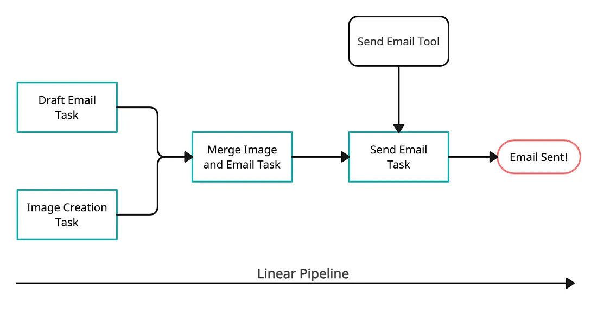

> **Note**: you can also refer the youtube tutorial, given [here](https://www.loom.com/share/3047db02d1bc40a49cb00032372452f2?sid=8a21aa3d-8ea6-4a88-9d93-5330fb0a5973).


## Setup

Create a new folder, initialize a virtual environment, and activate it:

```bash
virtualenv my_env
source my_env/bin/activate
```

Install the required packages:

```bash
pip install lyzr-automata==0.1.2 python-dotenv==1.0.1
```

Create a `.env` file in your project directory and include the following variables:

```python
OPENAI_API_KEY = "YOUR OPENAI API KEY"
EMAIL = "YOUR EMAIL ID" # Your SMTP email/username 
PASSWORD = "YOUR APP PASSWORD" # Your SMTP password
SMTP_SERVER_HOST = "smtp.gmail.com" # SMTP server host, for gmail it can be the default
```

> **Note**: For obtaining your App Password, follow the steps [here](https://support.google.com/accounts/answer/185833?hl=en).

## Get Started

Let’s initiate our project by creating a `main.py` file:

```python
from dotenv import load_dotenv
import os

load_dotenv()

OPENAI_API_KEY = os.getenv("OPENAI_API_KEY")
PASSWORD = os.getenv("PASSWORD")
EMAIL = os.getenv("EMAIL")
```

### Initialise our Model

We will use two models:
- A **Text completion model** for creating content (GPT-4).
- A **Text to Image model** to generate a suitable image (DALL-E-3).

<CodeBlock>
```python
from lyzr_automata.models import OpenAIModel

open_ai_model_text = OpenAIModel(
    api_key=OPENAI_API_KEY,
    parameters={
        "model": "gpt-4-turbo-preview",
        "temperature": 0.2,
        "max_tokens": 1500,
    },
)

open_ai_model_image = OpenAIModel(
    api_key=OPENAI_API_KEY,
    parameters={
        "n": 1,
        "model": "dall-e-3",
    },
)
```
</CodeBlock>

### Build our agent

```python
from lyzr_automata import Agent

content_researcher_agent = Agent(
    prompt_persona="You are an intelligent Travel Newsletter writer good at writing a detailed newsletter on a particular destination",
    role="Travel Newsletter writer",
)
```

### Implement your Tasks

Define tasks for newsletter content creation, image generation, and merging content with images for our newsletter.
```python
from lyzr_automata import Task
from lyzr_automata.tasks.task_literals import InputType, OutputType

# Newsletter Content Creator Task
content_creation_task = Task(
    name="Draft Content Creator",
    agent=content_researcher_agent,
    output_type=OutputType.TEXT,
    input_type=InputType.TEXT,
    model=open_ai_model_text,
    instructions="Write a travel newsletter on Mumbai in 500 words and [IMPORTANT!] send the response in html use bullets for points and beautify it be as creative as you want.",
    log_output=True,
    enhance_prompt=False,
)

# Image Creator Task
image_creation_task = Task(
    name="Newsletter Image Creation",
    output_type=OutputType.IMAGE,
    input_type=InputType.TEXT,
    model=open_ai_model_image,
    log_output=True,
    instructions="Use the travel newsletter provided and create an image that would be suitable for posting. Avoid any text in the image",
)

# Merge Image and Content Task
merge_image_text_task = Task(
    name = "Merge Image and Email",
    model=open_ai_model_text,
    log_output=True,
    instructions="Include the image in the html code provided. Return only the HTML and CSS code",
    input_tasks = [research_task, image_creation_task]
)
```

### Create our Email Sender Tool

```python
from lyzr_automata.tools.prebuilt_tools import send_email_by_smtp_tool

email_sender = send_email_by_smtp_tool(
    username=EMAIL,
    password=PASSWORD,
    host=SMTP_SERVER_HOST,
    port=587,
    sender_email=EMAIL
)
```


### Task flow
We will construct the flow outlined below, utilizing a pipeline in the subsequent steps.



### Create Pipeline and execute the tasks
Utilize the `LinearSyncPipeline` to execute our tasks in sequence and send out the newsletter email.

```python
from lyzr_automata.pipelines.linear_sync_pipeline import LinearSyncPipeline
from lyzr_automata import Logger

def main_program():
    logger = Logger()
    LinearSyncPipeline(
        logger=logger,
        name="Send Email",
        completion_message="Email Sent!",
        tasks=[
            research_task,
            image_creation_task,
            merge_image_text_task,
            send_email_task
        ],
    ).run()

main_program()
```

### Final output
Run the file and find the email in your inbox!