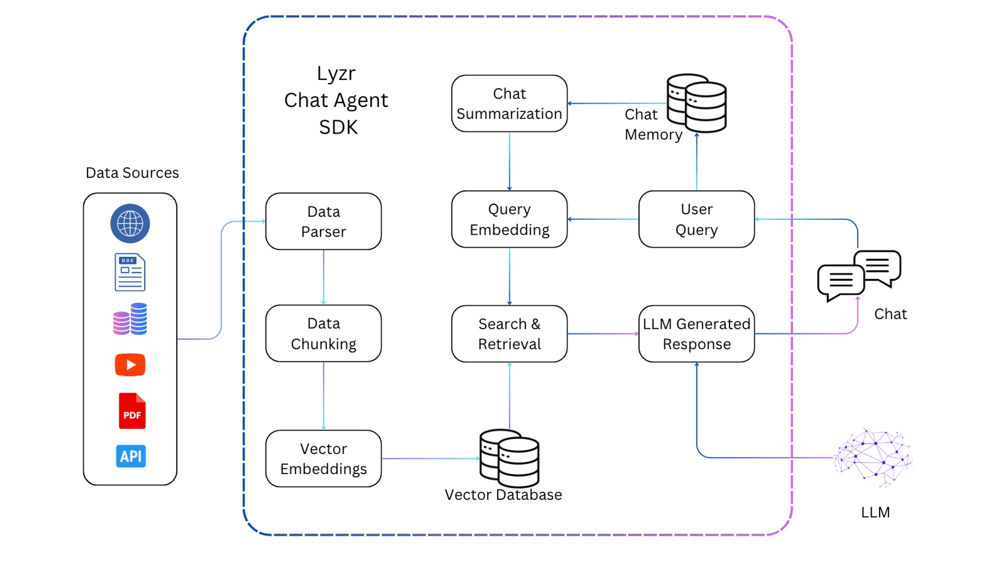

## Getting Started
Welcome to the Search Agent SDK documentation. This guide will help you integrate diverse data sources into your search agent, enhancing its conversational capabilities. We'll cover everything from getting started, integrating various data sources, to customizing your agent with global parameters. Let's dive in!
### **Introduction**

The Search Agent SDK provides a powerful toolkit for building sophisticated search capabilities into your chat or search engines. By integrating a variety of data sources and leveraging advanced machine learning models, you can create an agent that understands and responds to queries with high relevance and accuracy.

**Lyzr's Search Agent integrates all the building blocks of a Search**

## What are the various methods and arguments that you could pass to Lyzr's Search class?

**Methods**
| Method       | What it does?                                                       |
| ------------ | ------------------------------------------------------------------- |
| add_pdf     | train and search accross PDF documents                                             |
| add_website | automatically scrape the website content, train and search accross website data |
| add_docx    | train and search accross Microsoft Word documents                                  |
| add_txt     | train and search accross flat files                                                |
| add_youtube | train and search accross youtube content (must have transcriptions)                |
| add_webpage | automatically scrape the webpage content, train and search accross webpage data |